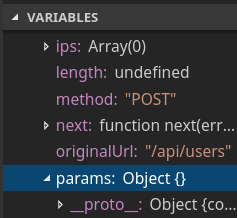

# Debugando e explorando o Node.js: Além do console.log

É muito comum quando nos deparamos com algum bug em Node.js, começar a marcar vários trechos de codigo com `console.log`.  
Mas conforme a coisa vai ficando séria, se torna cada vez mais dificil extrair informações úteis e precisas sobre o que (e onde) está acontecendo, além de saídas confusas dos logs (quem nunca no desespero usou um `console.log("AAAAAAAAAAAAAAAAAAAAA")`).

## Se preparando

Nesse artigo, iremos usar o [VS Code](https://code.visualstudio.com/) como frontend para o debugger do Node.js.

Para simular um caso mais próximo da realidade, estou disponibilizando como base uma simples aplicação feita usando `Node.js 9.3.0` e `Express 4`. A aplicação está disponível [nesse repositório](https://github.com/hails/debugging-nodejs).

## Conhecendo a aplicação

Nossa aplicação é uma API CRUD (acrônimo de Create Read Update Delete) para cadastro de usuários.

As rotas são as seguintes:

| Verbo HTTP | Rota | O que faz |
| ---|  --- | ---|
| GET | /api/users | Lista todos os usuários cadastrados |
| GET | /api/users/:user_id | Lista o usuário de id `:user_id` |
| POST | /api/users | Cria um novo usuário |

>Para criar um novo usuário, deve-se enviar um JSON com os seguintes campos: `username`, `real_name` e `country`.
>
> Exemplo:
> ```
> {
>   "username": "hails",
>   "real_name": "Allan Jorge",
>   "country": "BR"
> }
> ```

## Rodando e testando a aplicação

Após clonar o [repositório do projeto](https://github.com/hails/debugging-nodejs), instale as dependências usando seu package manager favorito:

- yarn
  ```sh
  $ yarn
  ```
- npm
  ```sh
  $ npm install
  ```

Com as dependências instaladas, vamos rodar nossa aplicação:

```sh
$ node index.js
```
```
Server ready and listening on port 3000
```

Agora com a aplicação rodando, podemos testá-la!  
Pessoalmente, gosto de usar o [HTTPie](https://httpie.org/) para fazer requests http direto do meu terminal, mas sinta-se livre para usar a ferramente que foi mais confortável para você, como o [Postman](https://www.getpostman.com/), por exemplo.

Vamos começar dando um `GET` na rota `/api/users` e ver o que ela nos retorna:

- Request
  ```sh
  $ http get :3000/api/users
  ```
- Response
  ```json
  []
  ```

Legal!  
A API nos retornou um array vazio (`[]`), pois não temos nenhum usuário cadastrado. Logo, vamos dar o próximo passo e cadastrar nosso primeiro usuário:

- Request
  ```sh
  $ echo '{"username": "hails", "real_name": "Allan Jorge", "country": "BR"}' | http post :3000/api/users
  ```
- Response
  ```json
  {
      "user_id": 1
  }
  ```

Pelo visto agora temos um usuário cadastrado. Que tal consultarmos pelo `user_id` dele?

- Request
  ```sh
  $ http get :3000/api/users/0
  ```
- Response
  ```json
  {
    "user_id": 0
  }
  ```

Essa resposta está estranha, algo de errado não está certo.

## Ei, parece que temos um bug!

Tanto ao completar o Request quanto na Response, o que queremos de retorno é o objeto completo do usuário cadastrado, como por exemplo:

```json
{
  "user_id": 0,
  "username": "hails",
  "real_name": "Allan Jorge",
  "country": "BR"
}
```

Mas só recebemos o `user_id` como retorno.

Investigando a source, chegamos a conclusão que o problema deve estar no método [`create`](https://github.com/hails/debugging-nodejs/blob/99e19f8c780531b0f246ed7be42ee6fc588b968d/controllers/user.js#L12) do arquivo `controllers/user.js`.  
O bug pode estar em qualquer lugar, dado que não estamos familiar com a codebase e a aplicação carece de **testes automatizados**.  
Nossos instintos podem estar gritando para colocarmos alguns `console.log`s no código, como após a definição da variável `user`, ou depois da `userResponse`.  
Mas vamos com calma pois temos ferramentas melhores para nos ajudar nesses casos!

## Usando o Inspector do Node.js

>Nota: essa feature ainda está em estado experimental

Desde a sua [versão 6.3](https://nodejs.org/en/blog/release/v6.3.0/), o Node.js vem com suporte nativo ao Inspector Protocol, possibilitando o uso de breakpoints, introspecção de codigo e várias outras ferramentas de debbuging apenas com o uso de uma flag. Você pode ler mais sobre o Inspector nas [docs oficiais do Node.js](https://nodejs.org/en/docs/inspector/).

### Iniciando o inspector agent do Node.js

> Não se esqueça de terminar o processo da aplicação que usamos anteriormente

Para começarmos a usar o Inspector, precisamos iniciar nossa aplicação usando a flag `--inspect` junto ao executável do Node.  
Então ao invés de fazer como antes:
```sh
$ node index.js
```

Vamos aplicar a flag:
```sh
$ node --inspect index.js
```

Devemos ver uma mensagem sobre o `debugger` estar rodando, além do nosso servidor:
```
Debugger listening on ws://127.0.0.1:9229/a7d5b063-09c4-40e9-baac-318efee0ad9f
For help see https://nodejs.org/en/docs/inspector
Server ready and listening on port 3000
```

A partir de agora, podemos usar qualquer "frontend" que suporte o Inspector Protocol para começarmos a debugar!

### Debugando com o VS Code

Com o VS Code aberto, basta escolhermos a opção `Debug` no menu esquerdo ou usar o atalho `CTRL + Shift + D`:


Como VS Code, temos duas opções principais para debugarmos uma aplicação Node.js:
 - Dar `attach` diretamente ao `debugger` (chamarei de `Node Attach`)
 - Rodar a aplicação em modo debug direto pelo VS Code (chamarei de `Launch Program`)`

#### Node Attach

Nesse modo, o VS Code irá se comunicar diretamente com o `debugger`, assim sendo possível até debugar uma aplicação que esteja em um servidor remoto!

Vamos, então, criar a configuração o `Node Attach`.

No canto inferior esquerdo, ao lado de `DEBUG`, selecione a opção `Add Configuration...`


O arquivo de configuração nada mais é que um `JSON`, chamado `launch.json`, que pode ser configurado por projeto e conter diversos modos diferentes para o mesmo projeto.
 
No nosso caso, vamos usar as configurações abaixo:
```json
{
  // Use IntelliSense to learn about possible attributes.
  // Hover to view descriptions of existing attributes.
  // For more information, visit: https://go.microsoft.com/fwlink/?linkid=830387
  "version": "0.2.0",
  "configurations": [

    {
      "type": "node",
      "request": "attach",
      "name": "Node Attach",
      "port": 9229
    },

  ]
}
```

Para começar a debugar, basta ir no mesmo menu onde escolhemos a opção `Add Configuration...` e escolher agora a opção `Node Attach`


O código da aplicação estará disponível no canto inferior esquerdo, no menu `LOADED SCRIPTS`, com o nome do projeto, no caso `debugging-nodejs`


#### Launch Program

Nesse modo, vamos deixar que o própio VS Code inicialize a aplicação, sendo muito prático pra quando estamos desenvolvendo locamente usando o próprio VS Code.

> Como o próprio VS Code irá rodar a aplicação, não se esqueça de terminar qualquer instancia do Node que ainda esteja rodando!

Usando praticamente os mesmos passos do `Node Attach`, vamos adicionar mais uma configuração, resultando no seguinte `launch.json`:
```json
{
  // Use IntelliSense to learn about possible attributes.
  // Hover to view descriptions of existing attributes.
  // For more information, visit: https://go.microsoft.com/fwlink/?linkid=830387
  "version": "0.2.0",
  "configurations": [
    {
      "type": "node",
      "request": "launch",
      "name": "Launch Program",
      "program": "${workspaceFolder}/index.js"
    },
    {
      "type": "node",
      "request": "attach",
      "name": "Node Attach",
      "port": 9229
    },

  ]
}
```

Repare que agora temos uma configuração com `name` de `Launch Program`, que vai basicamente executar o arquivo Javascript que estiver definido em `program`.  
No caso, queremos que ele execute o arquivo `index.js` que está na raiz do nosso projeto (`${workspaceFolder}`).

Para começar a debugar, basta ir no mesmo menu onde escolhemos a opção `Add Configuration...` e escolher agora a opção `Launch Program`


O código da aplicação estará disponível normalmente.

### Gotta Debug 'Em All!

Agora vamos de fato começar a debugar a aplicação para entender onde está o problema. 
Dado a nossa investigação anterior, percebemos que o problema pode estar em algum lugar do método `create` do arquivo `controllers/user.js`. O próximo passo, então, é colocar um `breakpoint` em alguma linha dentro do método, para que a execução seja pausada ali e possamos fazer uma instrospecção no código.

Inserir um `breakpoint` é bem simples!  
Com o arquivo que você quer debugar aberto, basta clicar com o botão esquerdo do mouse bem do lado do número da linha que deseja para a execução. No nosso caso, optei por parar a execução na [linha 21](https://github.com/hails/debugging-nodejs/blob/99e19f8c780531b0f246ed7be42ee6fc588b968d/controllers/user.js#L21), pois assim conseguimos ver o estado de todas as variáveis que pertecem ao método.


Olhando mais de perto, repare no circulo vermelho ao lado da linha 21:


Toda vez que o arquivo for executado, a execução pausará nessa linha.

Já com a aplicação rodando em modo `debug`, vamos fazer novamente um request para criar um usuário:
```sh
$ echo '{"username": "hails", "real_name": "Allan Jorge", "country": "BR"}' | http post :3000/api/users
```
Perceba que não recebemos uma resposta, isso porque a aplicação está "congelada" na linha 21, esperando que tomemos alguma ação!
Então, agora, temos que descobrir onde está o problema e para isso iremos no menu `VARIABLES`, no canto esquerdo.  
Aqui conseguimos ver todas as variáveis que estão dentro dos nossos contextos (`Local`, `Closure` e `Global`)


Vamos espiar em como está o objeto `user`, dentro de `Local`:


**HOLY JESUS**

Todas as chaves estão com os valores `undefined`, a não ser o `user_id`.

Como pegamos esses valores do `req.params`, podemos inspecioná-lo a partir do objeto `req` 




O objeto `req.params` está vazio, por isso quando tentamos pegar os valores dele para o objeto `user`, acaba retornando `undefined`.

Para os mais experientes com o Express, está na cara o erro: o `body` de um request `POST` no Express não fica em `req.params`, e sim em `req.body` pois usei um `middleware` chamado `body-parser`.  
Podemos validar isso inspecionando o objeto `body`, como fizemos com o `params`:


**AHA!**

Achamos onde de fato estão as informações que precisamos!

Agora é só [alterar o código](https://github.com/hails/debugging-nodejs/blob/e662e20a37e94bec10cda6b2d25ec7a0c24f015f/controllers/user.js#L13), referenciando `req.body` ao invés de `req.params` e rodar a aplicação normalmente.

Vamos testar para ver se está tudo ocorrendo como deveria
- Request
  ```sh
  $ echo '{"username": "hails", "real_name": "Allan Jorge", "country": "BR"}' | http post :3000/api/users
  ```
- Response
  ```sh
  {
    "country": "BR",
    "real_name": "Allan Jorge",
    "user_id": 0,
    "username": "hails"
  }
  ```

**FUNCIONA**

Em poucos passos conseguimos achar onde estava o problema, sem ter que nos descabelar em meio de um mar de `console.log` e sem ter que alterar uma linha da aplicação em si.

## Considerações finais

Esse artigo foi mais uma leve introdução do quão prático e fácil pode ser o seu uso no dia-a-dia.  
Usar o Inspector do Node.js pode ajudar muito a debuggar comportamentos estranhos, entender conceitos como Closures ou simplesmente entender mais os internals da V8, acompanhando o passo-a-passo de cada ação.  
Além do VS Code, você pode também usar o Chrome DevTools e vários outros frontends, basta consultar a [documentação oficial do Inspector](https://nodejs.org/en/docs/inspector/) e ver o qual melhor atende às suas necessidades.

Vou ficando por aqui, meu twitter é [@noneisone](http://twitter.com/noneisone) e meu Github é [@hails](https://twitter.com/noneisone)

